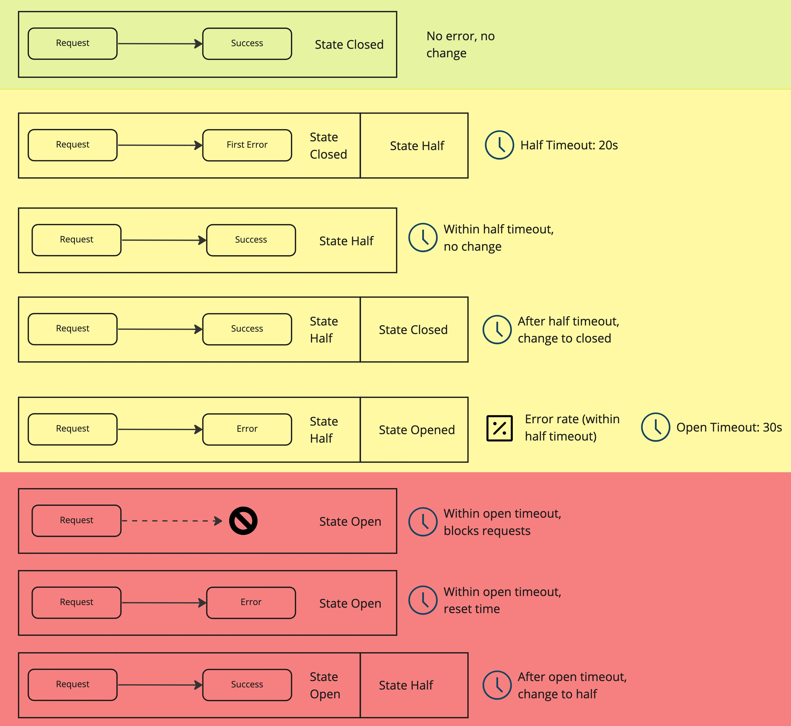
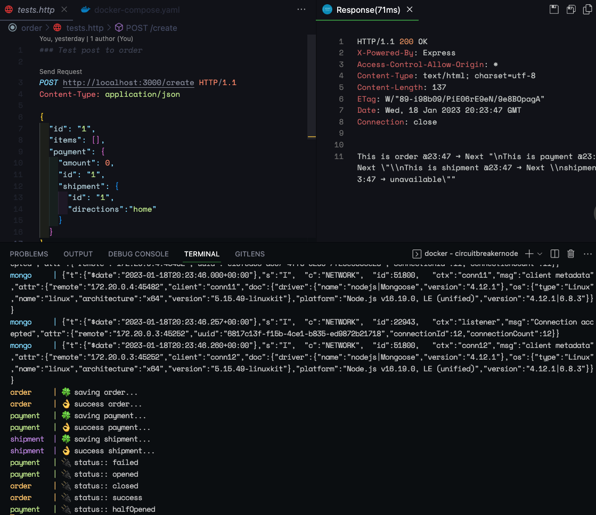

# Circuit-breaker project

## Introduction

Resilience in the **micro-services** world is a concept that should be as relevant as speed, scalability, portability, etc. but it is sometimes overlooked when designing solutions. This is because many times the concerns around network, availability, stability that would be a top priority in traditional distributed systems, seem to no longer be an issue when working with technologies like public clouds or Kubernetes.

However, EVEN if these issues are less common and the mentioned platforms have many features to reduce the possibilities or impact, in the end are in no way 100% guarantied or have some kind of restrictions. A very simple example of this is when connecting to 3rd party systems, that could not be reliable. Our systems need to be prepared and fail gracefully.

As we can see in the figure, we are describing some of the important principles we need to take into account such as cohesion and coupling, responsibility, metrics, observability, etc. when designing micro-services.


## Introducing the circuit-breaker:

It is pattern, as well as a state machine, which has 3 states (open, half-opened, and closed) that represent the flow and confidence of communication throughout the services. It does all this with the configuration of relevant limits, thresholds and timeouts with which it monitors the responses of subsequent requests from a service to another.

Depending on the implementation, the states may change names or events

The communication is managed depending on the errors. If the “target” service fails a particular number of times in a certain amount of time, the “source” service will temporarily stop sending requests. All these timeouts and rates are parameters that can be adapted to each service's expected behaviour. 

The correct calculations of this parameters and rates are a very interesting and extensive topic

If we watch each case depending on the state we will see the following:



1. For the first case (marked in green), if there is no error, the circuit remains closed with no changes
2. The second case, beginning in yellow, when we find the first error in the request, the state will change to half and begin the timeout related to this state
3. In the  third case, if subsequent requests result in success, it still will wait for the timeout to return to the “Closed” state
4. For the forth case, after the timeout has been reached, subsequent success requests will return the circuit to closed state
5. However, in the fifth case, if consecutive errors happen within the timeout and we reach a defined error rate (or minimum error requests), the circuit will change to “Open State”
6. We are now in the red area in this state, for the sixth case, a new timeout will begin, that all subsequent request will be blocked so, they won't reach the target service
7. After this timeout in the seventh case, if subsequent errors occur, the “open timeout” will start over, and block again
8. Finally, in the last case, if the subsequent request after the timeout resolves, is succesful, the state will change to half and it's own timeout will begin again

## Previous Demos

[GitHub - casimon-rh/gs-nodejs-demo1](https://github.com/casimon-rh/gs-nodejs-demo1)

[GitHub - casimon-rh/gs-nodejs-demo2](https://github.com/casimon-rh/gs-nodejs-demo2)

## Third Demo

For our last demo, we take the implementation of the second one, but turn it into a common use case:

This involves a retail process, generate Order, Apply payment and trigger a shipment


The main differences are the following:

```
.
├── circuitbreaker.code-workspace
├── docker-compose.yaml
├── order
│   ├── Dockerfile
│   ├── index.ts
│   ├── package-lock.json
│   ├── package.json
│   ├── runlocal.sh
│   ├── src
│   │   ├── controller.ts
│   │   ├── db.ts
│   │   └── messages.ts
│   ├── tests.http
│   └── tsconfig.json
├── payment
│   ├── Dockerfile
│   ├── index.ts
│   ├── package-lock.json
│   ├── package.json
│   ├── runlocal.sh
│   ├── src
│   │   ├── controller.ts
│   │   ├── db.ts
│   │   └── messages.ts
│   ├── tests.http
│   └── tsconfig.json
└── shipment
    ├── Dockerfile
    ├── index.ts
    ├── package-lock.json
    ├── package.json
    ├── runlocal.sh
    ├── src
    │   ├── controller.ts
    │   ├── db.ts
    │   └── messages.ts
    ├── tests.http
    └── tsconfig.json
```

We have a directory for each service (with the differences), and also a docker-compose definition

In each service directory we divided the code in 4 files: 

`index.ts` with the definitions of express as well as the main reference to mongoose for database, 

`db.ts` with definitions that connect each service with an instance of MongoDB and also the definitions of the model

`messages.ts` with some variables related to responses and logs 

and finally `controller.ts` with the definitions of circuit-breaker and endpoint. Here we can see that we share the implementation of the 2nd service, relating to the jump limits and the circuit breaker instance. But we will add the persistence in each case, simulating a real use case

```tsx
//src/controller.ts
import axios, { AxiosResponse } from 'axios'
import CircuitBreaker from 'opossum'
import { Request, Response, Express } from 'express'
import { createOrder, Order } from './db'
import { errmsg, message } from './messages'

const jumps = process.env.JUMPS || 6
const throwError = () => 
	Math.random() > .6 && process.env.INJECT_ERR === '1'

const chain = (endpoint: string, order: Order): Promise<string> =>
  new Promise((resolve, reject) =>
    axios.post(endpoint, order.payment)
      .then((response: AxiosResponse) =>
        resolve(message(response.data))
      ).catch((err: any) =>
        reject(message(err.response.data))
      )
  )

const breaker = new CircuitBreaker(chain, {
  timeout: 300, 
  errorThresholdPercentage: 50, 
  resetTimeout: 10000 
})

export const routes = (app: Express) => {
  app.get('/', (req: Request, res: Response) =>
		res.send(`hello from ${process.env.ID}\n`))

  app.post('/create', async (req: Request, res: Response) => {
    const count = (parseInt(`${req.query['count']}`) || 0) + 1
    const endpoint = `${process.env.CHAIN_SVC}?count=${count}`
    const myorder = await createOrder(req.body)
    if (throwError())
      return res.status(502).send(message(errmsg()))

    if (count >= jumps)
      return res.status(200).send('\nLast')
    try {
      const response = await breaker.fire(endpoint, myorder)
      res.status(200).send(response)
    } catch (error) {
      res.status(200).send(error)
    }
  })
}

breaker.on("fallback", () => console.log('🔌 status:: fallback'))
breaker.on("success", () => console.log("🔌 status:: success"))
breaker.on("failure", () => console.log("🔌 status:: failed"))
breaker.on("timeout", () => console.log("🔌 status:: timed out"))
breaker.on("reject", () => console.log("🔌 status:: rejected"))
breaker.on("open", () => console.log("🔌 status:: opened"))
breaker.on("halfOpen", () => console.log("🔌 status:: halfOpened"))
breaker.on("close", () => console.log("🔌 status:: closed"))
```

```tsx
//index.ts
import express, { Express } from 'express'
import cors from 'cors'
import mongoose from 'mongoose'
import { routes } from './src/controller'

const app: Express = express()
mongoose.Promise = global.Promise
app.use(cors({ origin: '*' }))
app.use(express.json())
const port = process.env.PORT || 3000

routes(app)

app.listen(port, 
	() => console.log(`🕹  App listening on port ${port}`)
)
```

```tsx
//src/db.ts
import { connect, model, Schema } from "mongoose"
export interface Order {
  id: string
  date?: Date
  items: any[]
  payment: any
}
export const db = {
  url: process.env.MONGO_URL,
  order: model<Order>('Order', new Schema<Order>({
    id: { type: String, required: true },
    date: Date,
    items: { type: [], required: true },
    payment: { type: {}, required: true }
  }))
}
export const createOrder = async (norder: Order) => {
  await connect(db.url || '')
  console.log(`🍀 saving ${process.env.ID}...`)
  const myorder = new db.order({ ...norder })
  await myorder.save()
  console.log(`👌 success ${process.env.ID}...`)
  return myorder
}
```

```tsx
//src/messages.ts
export const curtime = () => 
	`${new Date().getMinutes()}:${new Date().getSeconds()}`

export const message = (data: any) =>
  `\nThis is ${process.env.ID} `+
	`@${curtime()} -> Next ${JSON.stringify(data)}`

export const errmsg = () =>
  `\n${process.env.ID} @${curtime()} -> unavailable`
```

Now instead of a script, we have a Compose definition in order to rebuild and start each one of our containers including the MongoDB instance

Please note the configuration implemented, considering environment, ports, locations, etc.

```yaml
version: "3"
services:
  order:
    container_name: order
    image: docker.io/library/order:breaker
    restart: always
    build: order/.
    hostname: order
    pull_policy: build
    networks:
    - circuitbreaker
    environment:
    - ID=order
    - CHAIN_SVC=http://payment:3000/create
    - JUMPS=4
    - MONGO_URL=mongodb://mongo:27017
    - PORT=3000
    ports:
    - 3000:3000
  payment:
    container_name: payment
    image: docker.io/library/payment:breaker
    restart: always
    build: payment/.
    hostname: payment
    pull_policy: build
    networks:
    - circuitbreaker
    environment:
    - ID=payment
    - CHAIN_SVC=http://shipment:3000/create
    - JUMPS=4
    - MONGO_URL=mongodb://mongo:27017
    - PORT=3000
    ports:
    - 3001:3000
  shipment:
    container_name: shipment
    image: docker.io/library/shipment:breaker
    restart: always
    build: shipment/.
    hostname: shipment
    pull_policy: build
    networks:
    - circuitbreaker
    environment:
    - ID=shipment
    - JUMPS=4
    - INJECT_ERR=1
    - MONGO_URL=mongodb://mongo:27017
    - PORT=3000
    ports:
    - 3002:3000
  mongo:
    container_name: mongo
    image: mongo
    networks:
    - circuitbreaker
    volumes:
      - ./data:/data/db
networks:
  circuitbreaker: {}
```

As we can see, for each service we are changing variables, as well as publishing different ports

To run this stack, we execute the following command:

```bash
docker-compose up
```

This will build and create the stack, and will follow all containers’ logs

And finally also in ever directory we have a “test.http”, that show the expected definitions of the payload:

```yaml
### Test post to order

POST http://localhost:3000/create HTTP/1.1
Content-Type: application/json

{
  "id": "1",
  "items": [],
  "payment": {
    "amount": 0,
    "id": "1",
    "shipment": {
      "id": "1",
      "directions":"home"
    }
  }
}
```

Note we have the payment and shipment objects nested inside the order object, for simplicity we are not validating nor making relations of this objects.



Now if we run consecutively our tests we will see the status of the different circuits changing, as well as the responses.

## Next Steps

As we can see, the Circuit Breaker Patter can help us manage the errors in the communication of micro-services, as well as dosing the interaction to unreliable destinations, both to avoid further saturation of the target as well as even controlling costs in error cases.

For the next steps, we could explore additional patterns and practices, such as Retry pattern, Bulkhead pattern and Chaos Engineering practice, that together with circuitbreaking, will improve even more the application's  reliability.

Another technology related is Istio, as well as the concept of Service Mesh, where we could achieve many of these patterns and implementations, not in the code, but in the immediate infrastructure, making the implementation potentially agnostic.